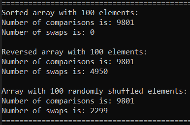
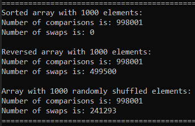
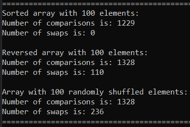
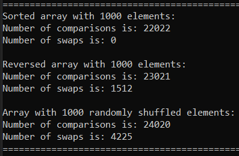
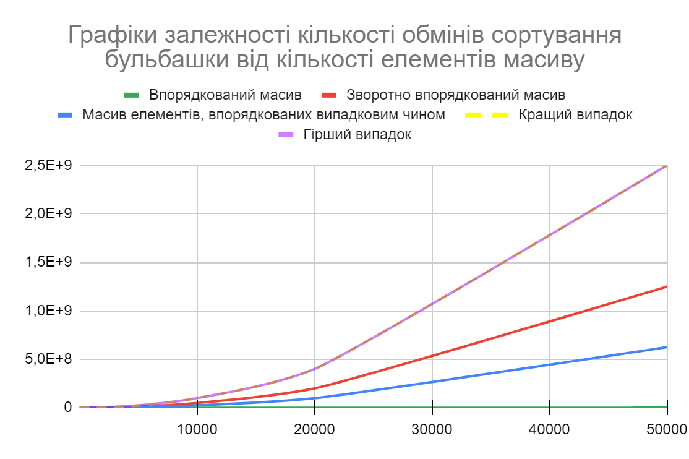
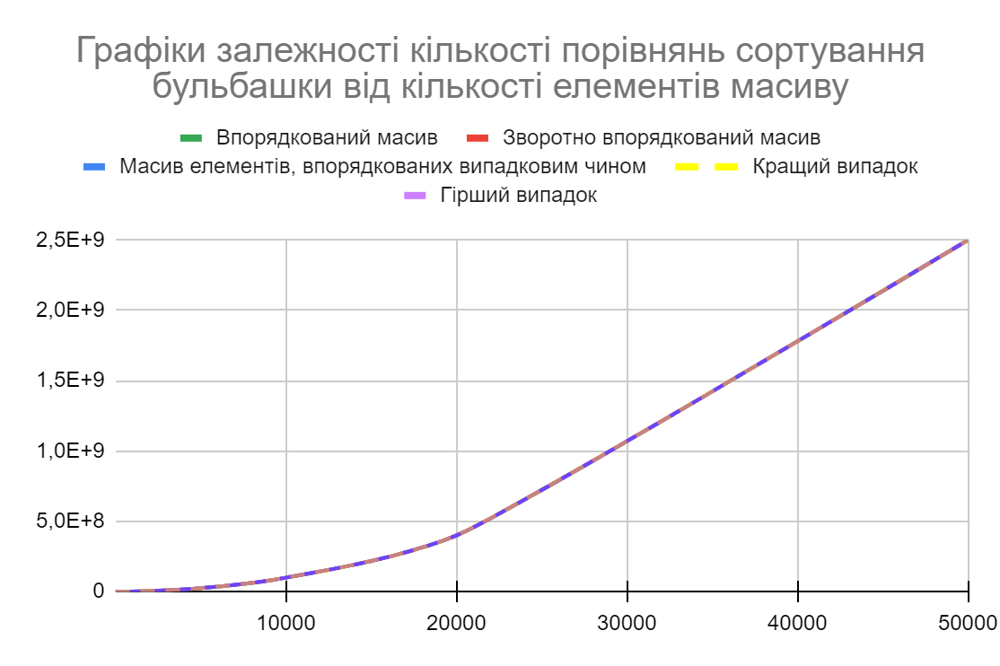
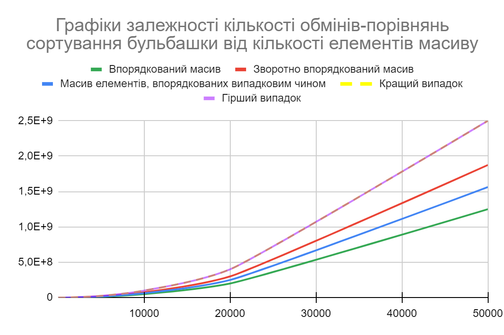
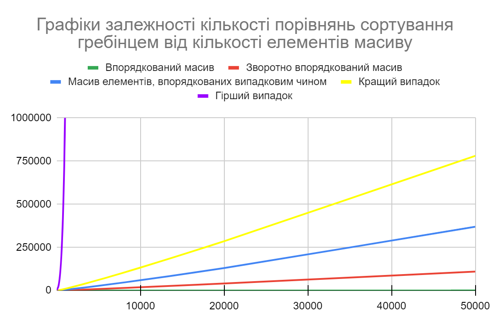
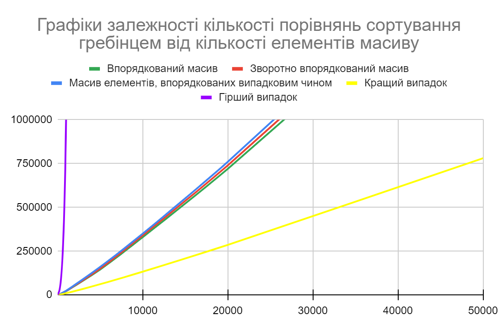
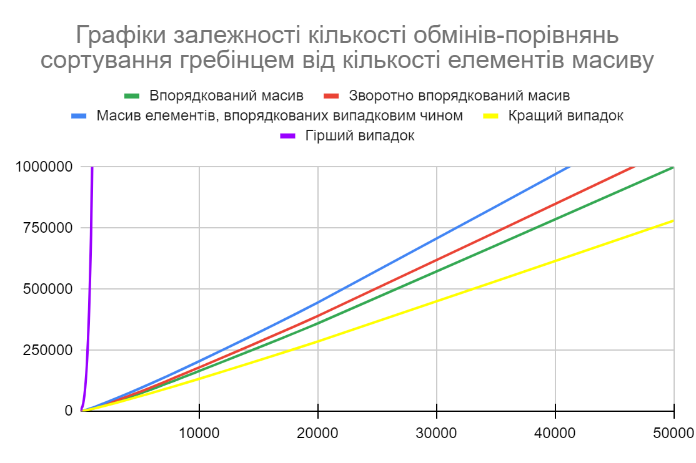

# Лабораторна робота №1

Мета роботи – вивчити основні методи аналізу обчислювальної складності алгоритмів 
внутрішнього сортування і оцінити поріг їх ефективності.

## Аналіз алгоритмів на відповідність властивостям наведено у таблиці:

| Властивість | Сортуваання бульбашкою | Сортування гребінцем |
| ----------- | ----------- | ----------- |
| Стійкість | Стійкий | Стійкий |
| "Природність" поведінки (Adaptability) | Ні | Так |
| Базуються на порівняннях | Так | Так |
| Необхідність в додатковій пам'яті (об'єм) | θ(1) | θ(1) |
| Необхідність в знаннях про структури даних | Масиви | Масиви |

## Псевдокод алгоритму

### Сортування бульбашкою
```
BubbleSort (arr, SIZE):
    for i = 1 to SIZE do 
        for j = 1 to SIZE do
            if arr[j] > arr[j + 1] then
                temp = arr[j]
                arr[j] = arr[j + 1]
                arr[j + 1] = temp
            end if
        end for
    end for
end BubbleSort
```

### Сортування гребінцем
```
CombSort (arr, SIZE):
    shrink_factor = 1.2473309
    gap = SIZE
    swapped = True
    while gap > 1 or swapped == True do
        gap = trunc (gap / shrink_factor)
        if gap < 1 then 
            gap = 1
        end if
        swapped = False
        for i = 1 to SIZE – gap + 1 do
            if arr[i] > arr[i + 1] then
                temp = arr[j]
                arr[j] = arr[j + 1]
                arr[j + 1] = temp
                swapped = True
            end if
        end for
    end while
end CombSort
```

## Аналіз часової складності

### Сортування бульбашкою
```
(n-1)+(n-1)+⋯+(n-1)=(n-1)∙(n-1)=n^2-2∙n+1=θ(n^2)
Кращий випадок: θ(n^2) 
(n-1)+(n-1)+⋯+(n-1)=(n-1)∙(n-1)=n^2-2∙n+1=Ω(n^2)
Середній випадок: Ω(n^2)
(n-1)+(n-1)+⋯+(n-1)=(n-1)∙(n-1)=n^2-2∙n+1=O(n^2)
Гірший випадок: O(n^2)
```
### Сортування гребінцем
```
Кращий випадок: θ(n∙log⁡(n))
Середній випадок: Ω(n^2)
Гірший випадок: O(n^2)
```

## Програмна реалізація алгоритму

### Вихідний код

#### Сортування бульбашкою
```
void BubbleSort(int* const arr, const int SIZE) {
	for (size_t i{ 0 }; i < SIZE - 1; ++i) {
		for (size_t j{ 0 }; j < SIZE - 1; ++j) {
			if (arr[j] > arr[j + 1]) {
				std::swap(arr[j], arr[j + 1]);
			}
		}
	}
}
```
#### Сортування гребінцем
```
void CombSort(int* const arr, const int SIZE) {
	const float shrink_factor{ 1.2473309 };
	int gap{ SIZE };
	bool swapped{ true };

	while (gap > 1 || swapped) {
		gap = static_cast <int> (static_cast <float> (gap) / shrink_factor);
		gap = gap > 1 ? gap : 1;

		swapped = false;
		for (size_t i{ 0 }; i < SIZE - gap; ++i) {
			if (arr[i] > arr[i + gap]) {
				std::swap(arr[i], arr[i + gap]);
				swapped = true;
			}
		}
	}
}
```
### Приклад роботи

#### Сортування бульбашкою

##### Сортування масиву на 100 елементів


##### Сортування масиву на 1000 елементів


#### Сортування гребінцем

##### Сортування масиву на 100 елементів


##### Сортування масиву на 1000 елементів


## Тестування алгоритму

### Часові характеристики оцінювання

#### Сортування бульбашкою

##### Характеристики оцінювання алгоритму сортування бульбашки для упорядкованої послідовності елементів у масиві наведено у таблиці:

| Розмірність масиву | Число порівнянь | Число перестановок |
| ----------- | ----------- | ----------- |
| 10 | 81 | 0 |
| 100 | 9801 | 0 |
| 1000 | 998001 | 0 |
| 5000 | 24990001 | 0 |
| 10000 | 99980001 | 0 |
| 20000 | 399960001 | 0 |
| 50000 | 2499900001 | 0 |

##### Характеристики оцінювання алгоритму сортування бульбашки для зворотно упорядкованої послідовності елементів у масиві наведено у таблиці:

| Розмірність масиву | Число порівнянь | Число перестановок |
| ----------- | ----------- | ----------- |
| 10 | 81 | 45 |
| 100 | 9801 | 4950 |
| 1000 | 998001 | 499500 |
| 5000 | 24990001 | 12497500 |
| 10000 | 99980001 | 49995000 |
| 20000 | 399960001 | 199990000 |
| 50000 | 2499900001 | 1249975000 |

##### Характеристики оцінювання алгоритму сортування бульбашки для випадкової послідовності елементів у масиві наведено у таблиці:

| Розмірність масиву | Число порівнянь | Число перестановок |
| ----------- | ----------- | ----------- |
| 10 | 81 | 22 |
| 100 | 9801 | 2299 |
| 1000 | 998001 | 241293 |
| 5000 | 24990001 | 6280738 |
| 10000 | 99980001 | 25122351 |
| 20000 | 399960001 | 99406077 |
| 50000 | 2499900001 | 624869448 |

#### Сортування гребінцем

##### Характеристики оцінювання алгоритму сортування гребінцем для упорядкованої послідовності елементів у масиві наведено у таблиці:

| Розмірність масиву | Число порівнянь | Число перестановок |
| ----------- | ----------- | ----------- |
| 10 | 36 | 0 |
| 100 | 1229 | 0 |
| 1000 | 22022 | 0 |
| 5000 | 144862 | 0 |
| 10000 | 329644 | 0 |
| 20000 | 719241 | 0 |
| 50000 | 1997958 | 0 |

##### Характеристики оцінювання алгоритму сортування гребінцем для зворотно упорядкованої послідовності елементів у масиві наведено у таблиці:

| Розмірність масиву | Число порівнянь | Число перестановок |
| ----------- | ----------- | ----------- |
| 10 | 45 | 9 |
| 100 | 1328 | 110 |
| 1000 | 23021 | 1512 |
| 5000 | 149861 | 9016 |
| 10000 | 339643 | 19132 |
| 20000 | 739240 | 40852 |
| 50000 | 2047957 | 109958 |

##### Характеристики оцінювання алгоритму сортування гребінцем для випадкової послідовності елементів у масиві наведено у таблиці:

| Розмірність масиву | Число порівнянь | Число перестановок |
| ----------- | ----------- | ----------- |
| 10 | 45 | 9 |
| 100 | 1328 | 236 |
| 1000 | 24020 | 4225 |
| 5000 | 159859 | 27444 |
| 10000 | 349642 | 59778 |
| 20000 | 759239 | 130239 |
| 50000 | 2097956 | 369603 |

### Графіки залежності часових характеристик оцінювання від розмірності масиву

#### Сортування бульбашкою





#### Сортування гребінцем





## Висновок

При виконанні даної лабораторної роботи було досліджено неоптимізоване сортування бульбашкою та його оптимізацію, сортування гребінцем, на стійкість (обидва алгоритми є стійкими), «природність» (сортування гребінцем природнє, бульбашкою – ні), базування на порівняннях (обидва алгоритми базуються на них), необхідність в додатковій пам’яті (відсутня для обох алгоритмів) та в знаннях про структури даних (масиви). Також було написано псевдокод алгоритмів, здійснено асимптотичну оцінку для кращого, середнього та гіршого випадків, реалізовано програму на мові C++, здійснено кілька перевірок роботи цих алгоритмів для масивів різної розмірності та побудовано відповідні графіки.
Отримані дані демонструють, що алгоритм сортування гребінцем значно ефективніший за алгоритм сортування бульбашкою, зокрема для великих масивів даних.
