**Міністерство освіти і науки України**

**Національний технічний університет України «Київський політехнічний
інститут імені Ігоря Сікорського\"**

**Факультет інформатики та обчислювальної техніки**

**Кафедра ІПІ**

**Звіт**

з лабораторної роботи № 1 з дисципліни

«Алгоритми та структури даних 2. Структури даних»

„ **Проектування і аналіз алгоритмів внутрішнього сортування**"

Київ 2022

Зміст

[1 Мета лабораторної роботи
[3](#мета-лабораторної-роботи)](#мета-лабораторної-роботи)

[2 ЗаВдання [4](#завдання)](#завдання)

[3 Виконання [5](#виконання)](#виконання)

[3.1 Аналіз алгоритму на відповідність властивостям
[5](#аналіз-алгоритму-на-відповідність-властивостям)](#аналіз-алгоритму-на-відповідність-властивостям)

[3.2 Псевдокод алгоритму
[5](#псевдокод-алгоритму)](#псевдокод-алгоритму)

[3.3 Аналіз часової складності
[6](#аналіз-часової-складності)](#аналіз-часової-складності)

[3.4 Програмна реалізація алгоритму
[6](#сортування-бульбашкою-1)](#сортування-бульбашкою-1)

[3.4.1 Вихідний код [7](#вихідний-код)](#вихідний-код)

[3.4.2 Приклад роботи [8](#приклад-роботи)](#приклад-роботи)

[3.5 Тестування алгоритму
[10](#тестування-алгоритму)](#тестування-алгоритму)

[3.5.1 Часові характеристики оцінювання
[10](#часові-характеристики-оцінювання)](#часові-характеристики-оцінювання)

[3.5.2 Графіки залежності часових характеристик оцінювання від
розмірності масиву
[13](#графіки-залежності-часових-характеристик-оцінювання-від-розмірності-масиву)](#графіки-залежності-часових-характеристик-оцінювання-від-розмірності-масиву)

[Висновок [17](#висновок)](#висновок)

[Критерії оцінювання [18](#критерії-оцінювання)](#критерії-оцінювання)

# Мета лабораторної роботи

Мета роботи -- вивчити основні методи аналізу обчислювальної складності
алгоритмів внутрішнього сортування і оцінити поріг їх ефективності.

# ЗаВдання

Виконати аналіз алгоритму внутрішнього сортування на відповідність
наступним властивостям (таблиця 2.1):

-   стійкість;

-   «природність» поведінки (Adaptability);

-   базуються на порівняннях;

-   необхідність додаткової пам\'яті (об\'єму);

-   необхідність в знаннях про структуру даних.

Записати алгоритм внутрішнього сортування за допомогою псевдокоду (чи
іншого способу по вибору).

Провести аналіз часової складності в гіршому, кращому і середньому
випадках та записати часову складність в асимптотичних оцінках.

Виконати програмну реалізацію алгоритму на будь-якій мові програмування
з фіксацією часових характеристик оцінювання (кількість порівнянь,
кількість перестановок, глибина рекурсивного поглиблення та інше в
залежності від алгоритму).

Провести ряд випробувань алгоритму на масивах різної розмірності (10,
100, 1000, 5000, 10000, 20000, 50000 елементів) і різних наборів вхідних
даних (впорядкований масив, зворотно упорядкований масив, масив
випадкових чисел) і побудувати графіки залежності часових характеристик
оцінювання від розмірності масиву, нанести на графік асимптотичну оцінку
гіршого і кращого випадків для порівняння.

Зробити порівняльний аналіз двох алгоритмів.

Зробити узагальнений висновок з лабораторної роботи.

Таблиця 2.1 -- Варіанти алгоритмів

  ------------------------------------------------------------------------
  **№**   **Алгоритм сортування**
  ------- ----------------------------------------------------------------
  1       Сортування бульбашкою

  2       Сортування гребінцем («розчіскою»)
  ------------------------------------------------------------------------

# Виконання

## Аналіз алгоритму на відповідність властивостям

Аналіз алгоритму сортування бульбашкою на відповідність властивостям
наведено в таблиці 3.1.

Таблиця 3.1 -- Аналіз алгоритму на відповідність властивостям

  -----------------------------------------------------------------------
  **Властивість**           **Сортування бульбашкою** **Сортування
                                                      гребінцем**
  ------------------------- ------------------------- -------------------
  Стійкість                 Стійкий                   Стійкий

  «Природність» поведінки   Ні                        Так
  (Adaptability)                                      

  Базуються на порівняннях  Так                       Так

  Необхідність в додатковій $$\theta(1)$$             $$\theta(1)$$
  пам\'яті (об\'єм)                                   

  Необхідність в знаннях    Масиви                    Масиви
  про структури даних                                 
  -----------------------------------------------------------------------

## Псевдокод алгоритму

### Сортування бульбашкою

BubbleSort (arr, SIZE):

**for** i = 1 **to** SIZE **do**

**for** j = 1 **to** SIZE **do**

**if** arr\[j\] \> arr\[j + 1\] **then**

temp = arr\[j\]

arr\[j\] = arr\[j + 1\]

arr\[j + 1\] = temp

**end if**

**end for**

**end for**

**end** BubbleSort

### Сортування гребінцем

CombSort (arr, SIZE):

shrink_factor = 1.2473309

gap = SIZE

swapped = **True**

**while** gap \> 1 **or** swapped == **True** **do**

gap = **trunc** (gap / shrink_factor)

**if** gap \< 1 **then**

gap = 1

**end if**

swapped = **False**

**for** i = 1 **to** SIZE -- gap + 1 **do**

**if** arr\[i\] \> arr\[i + 1\] **then**

temp = arr\[j\]

arr\[j\] = arr\[j + 1\]

arr\[j + 1\] = temp

swapped = **True**

**end if**

**end for**

**end while**

**end** CombSort

## Аналіз часової складності

### Сортування бульбашкою

$$(n - 1) + (n - 1) + \ldots + (n - 1) = (n - 1) \bullet (n - 1) = n^{2} - 2 \bullet n + 1 = \theta(n^{2})$$

Кращий випадок: $\theta(n^{2})$

$$(n - 1) + (n - 1) + \ldots + (n - 1) = (n - 1) \bullet (n - 1) = n^{2} - 2 \bullet n + 1 = \mathrm{\Omega}(n^{2})$$

Середній випадок: Ω$(n^{2})$

$$(n - 1) + (n - 1) + \ldots + (n - 1) = (n - 1) \bullet (n - 1) = n^{2} - 2 \bullet n + 1 = O(n^{2})$$

Гірший випадок: $O(n^{2})$

### Сортування гребінцем

Кращий випадок: $\theta(n \bullet log(n))$

Середній випадок: Ω$(n^{2})$

Гірший випадок: $O(n^{2})$

## Програмна реалізація алгоритму

### Вихідний код

1.  Сортування бульбашкою

> 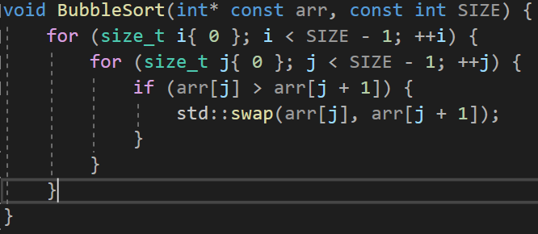{width="6.692361111111111in"
> height="2.9138888888888888in"}

2.  Сортування гребінцем

> 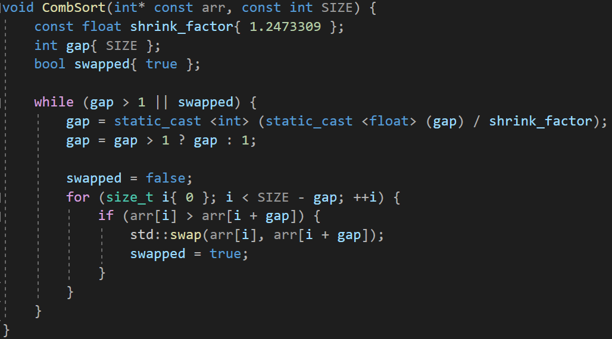{width="6.692361111111111in"
> height="3.7104166666666667in"}

### Приклад роботи

3.  Сортування бульбашкою

> На рисунках 3.1.1 та 3.2.1 показані приклади роботи програми
> сортування масивів на 100 і 1000 елементів відповідно.
>
> 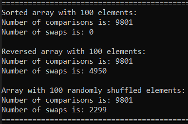{width="4.021394356955381in"
> height="2.6566207349081363in"}
>
> Рисунок 3.1.1 -- Сортування масиву на 100 елементів
>
> 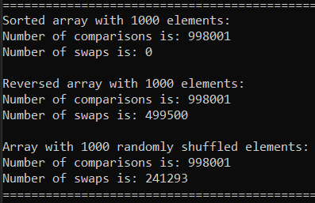{width="4.135994094488189in"
> height="2.6774573490813647in"}
>
> Рисунок 3.2.1 -- Сортування масиву на 1000 елементів

4.  Сортування гребінцем

> На рисунках 3.1.2 та 3.2.2 показані приклади роботи програми
> сортування масивів на 100 і 1000 елементів відповідно.
>
> 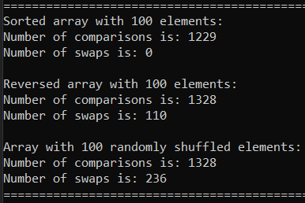{width="4.021394356955381in"
> height="2.68787510936133in"}
>
> Рисунок 3.1.2 -- Сортування масиву на 100 елементів
>
> 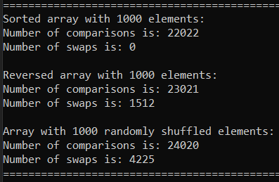{width="4.135994094488189in"
> height="2.698292869641295in"}
>
> Рисунок 3.2.2 -- Сортування масиву на 1000 елементів

##  Тестування алгоритму

### Часові характеристики оцінювання

В таблиці 3.2.1 наведені характеристики оцінювання числа порівнянь і
числа перестановок алгоритму сортування бульбашки для масивів різної
розмірності, коли масив містить упорядковану послідовність елементів.

Таблиця 3.2.1 -- Характеристики оцінювання алгоритму сортування
бульбашки для упорядкованої послідовності елементів у масиві

  -----------------------------------------------------------------------
  Розмірність масиву      Число порівнянь         Число перестановок
  ----------------------- ----------------------- -----------------------
  10                      81                      0

  100                     9801                    0

  1000                    998001                  0

  5000                    24990001                0

  10000                   99980001                0

  20000                   399960001               0

  50000                   2499900001              0
  -----------------------------------------------------------------------

В таблиці 3.3.1 наведені характеристики оцінювання числа порівнянь і
числа перестановок алгоритму сортування бульбашки для масивів різної
розмірності, коли масиви містять зворотно упорядковану послідовність
елементів.

Таблиця 3.3.1 -- Характеристики оцінювання алгоритму сортування
бульбашки для зворотно упорядкованої послідовності елементів у масиві.

  -----------------------------------------------------------------------
  Розмірність масиву      Число порівнянь         Число перестановок
  ----------------------- ----------------------- -----------------------
  10                      81                      45

  100                     9801                    4950

  1000                    998001                  499500

  5000                    24990001                12497500

  10000                   99980001                49995000

  20000                   399960001               199990000

  50000                   2499900001              1249975000
  -----------------------------------------------------------------------

У таблиці 3.4.1 наведені характеристики оцінювання числа порівнянь і
числа перестановок алгоритму сортування бульбашки для масивів різної
розмірності, масиви містять випадкову послідовність елементів.

Таблиця 3.4.1 -- Характеристика оцінювання алгоритму сортування
бульбашки для випадкової послідовності елементів у масиві.

  -----------------------------------------------------------------------
  Розмірність масиву      Число порівнянь         Число перестановок
  ----------------------- ----------------------- -----------------------
  10                      81                      22

  100                     9801                    2299

  1000                    998001                  241293

  5000                    24990001                6280738

  10000                   99980001                25122351

  20000                   399960001               99406077

  50000                   2499900001              624869448
  -----------------------------------------------------------------------

В таблиці 3.2.2 наведені характеристики оцінювання числа порівнянь і
числа перестановок алгоритму сортування гребінцем для масивів різної
розмірності, коли масив містить упорядковану послідовність елементів.

Таблиця 3.2.2 -- Характеристики оцінювання алгоритму сортування
гребінцем для упорядкованої послідовності елементів у масиві

  -----------------------------------------------------------------------
  Розмірність масиву      Число порівнянь         Число перестановок
  ----------------------- ----------------------- -----------------------
  10                      36                      0

  100                     1229                    0

  1000                    22022                   0

  5000                    144862                  0

  10000                   329644                  0

  20000                   719241                  0

  50000                   1997958                 0
  -----------------------------------------------------------------------

В таблиці 3.3.2 наведені характеристики оцінювання числа порівнянь і
числа перестановок алгоритму сортування гребінцем для масивів різної
розмірності, коли масиви містять зворотно упорядковану послідовність
елементів.

Таблиця 3.3.2 -- Характеристики оцінювання алгоритму сортування
гребінцем для зворотно упорядкованої послідовності елементів у масиві.

  -----------------------------------------------------------------------
  Розмірність масиву      Число порівнянь         Число перестановок
  ----------------------- ----------------------- -----------------------
  10                      45                      9

  100                     1328                    110

  1000                    23021                   1512

  5000                    149861                  9016

  10000                   339643                  19132

  20000                   739240                  40852

  50000                   2047957                 109958
  -----------------------------------------------------------------------

У таблиці 3.4.2 наведені характеристики оцінювання числа порівнянь і
числа перестановок алгоритму сортування гребінцем для масивів різної
розмірності, масиви містять випадкову послідовність елементів.

Таблиця 3.4.2 -- Характеристика оцінювання алгоритму сортування
гребінцем для випадкової послідовності елементів у масиві.

  -----------------------------------------------------------------------
  Розмірність масиву      Число порівнянь         Число перестановок
  ----------------------- ----------------------- -----------------------
  10                      45                      9

  100                     1328                    236

  1000                    24020                   4225

  5000                    159859                  27444

  10000                   349642                  59778

  20000                   759239                  130239

  50000                   2097956                 369603
  -----------------------------------------------------------------------

### Графіки залежності часових характеристик оцінювання від розмірності масиву

На рисунках 3.3.1.1, 3.3.1.2, 3.3.1.3, 3.3.2.1, 3.3.2.2, 3.3.2.3
показані графіки залежності часових характеристик оцінювання від
розмірності масиву для випадків, коли масиви містять упорядковану
послідовність елементів (зелений графік), коли масиви містять зворотно
упорядковану послідовність елементів (червоний графік), коли масиви
містять випадкову послідовність елементів (синій графік), також показані
асимптотичні оцінки гіршого (фіолетовий графік) і кращого (жовтий
графік) випадків для порівняння.

Рисунок 3.3.1 -- Графіки залежності часових характеристик оцінювання для
сортування бульбашкою

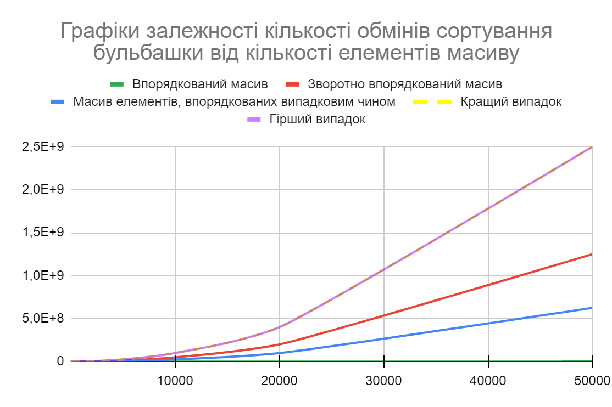{width="6.692361111111111in"
height="4.457638888888889in"}

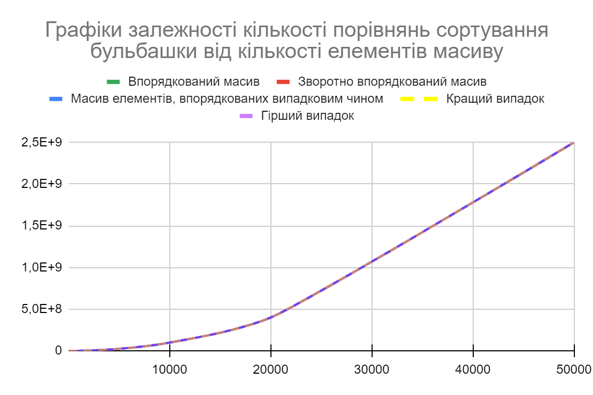{width="6.692361111111111in"
height="4.457638888888889in"}

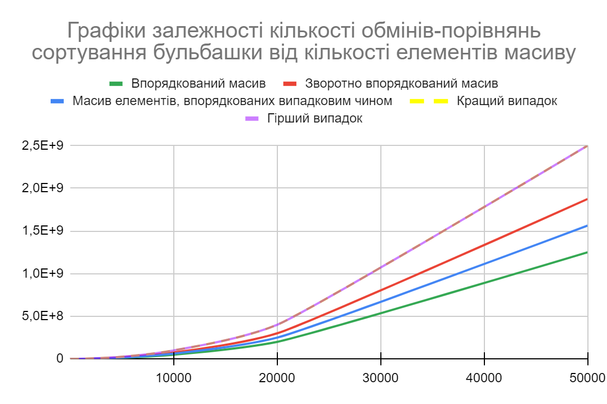{width="6.692361111111111in"
height="4.457638888888889in"}

Рисунок 3.3.2 -- Графіки залежності часових характеристик оцінювання для
сортування бульбашкою

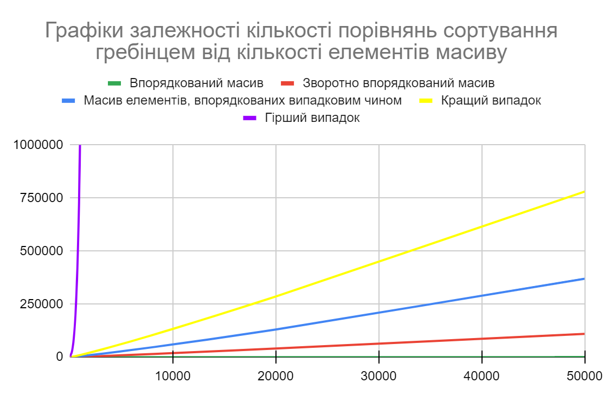{width="6.692361111111111in"
height="4.461805555555555in"}

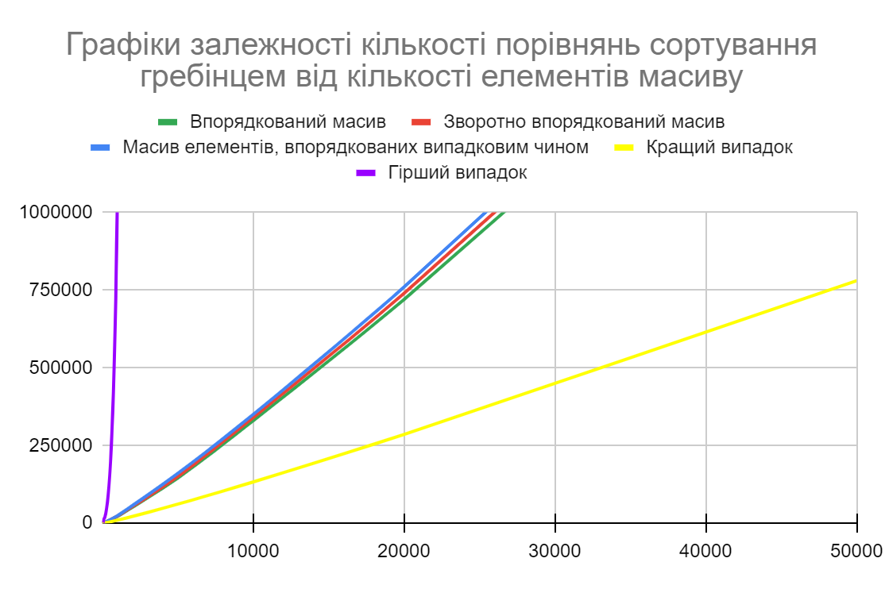{width="6.692361111111111in"
height="4.461805555555555in"}

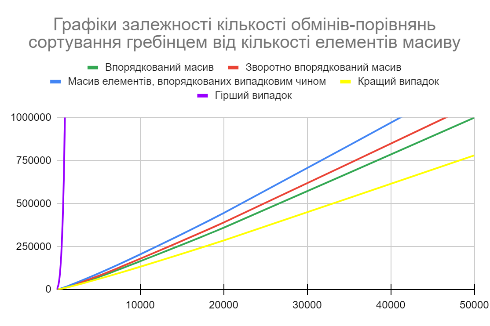{width="6.692361111111111in"
height="4.461805555555555in"}

# Висновок {#висновок .без-номера}

При виконанні даної лабораторної роботи було досліджено неоптимізоване
сортування бульбашкою та його оптимізацію, сортування гребінцем, на
стійкість (обидва алгоритми є стійкими), «природність» (сортування
гребінцем природнє, бульбашкою -- ні), базування на порівняннях (обидва
алгоритми базуються на них), необхідність в додатковій пам'яті (відсутня
для обох алгоритмів) та в знаннях про структури даних (масиви). Також
було написано псевдокод алгоритмів, здійснено асимптотичну оцінку для
кращого, середнього та гіршого випадків, реалізовано програму на мові
C++, здійснено кілька перевірок роботи цих алгоритмів для масивів різної
розмірності та побудовано відповідні графіки.

Отримані дані демонструють, що алгоритм сортування гребінцем значно
ефективніший за алгоритм сортування бульбашкою, зокрема для великих
масивів даних.

# Критерії оцінювання {#критерії-оцінювання .без-номера}

У випадку здачі лабораторної роботи до 21.02.2022 включно максимальний
бал дорівнює -- 5. Після 21.02.2022 -- 28.02.2022 максимальний бал
дорівнює -- 2,5. Після 28.02.2022 робота не приймається

Критерії оцінювання у відсотках від максимального балу:

-   аналіз алгоритму на відповідність властивостям -- 10%;

-   псевдокод алгоритму -- 15%;

-   аналіз часової складності -- 25%;

-   програмна реалізація алгоритму -- 25%;

-   тестування алгоритму -- 20%;

-   висновок -- 5%.
